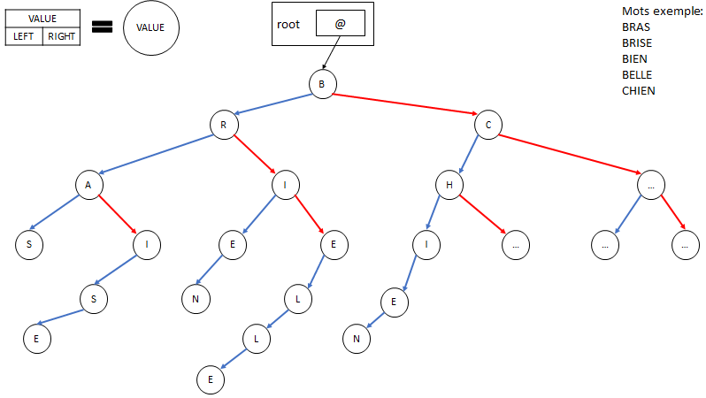

# Generateur de phrase
Générateur de phrase via l'utilisation d'arbre binaire et lecture d'un dictionnaire.\
Dans cet arbre binaire est stockée la totalité des mots sous leur forme basique.
Au sein d'un nœud, un pointeur redirige vers un tableau qui contient les formes dites fléchies des mots (conjugaisons pour les verbes, pluriel pour les mots, ...).\
\
Les flèches bleues symbolisent la conservation de la lettre du nœud précédent.
Les flèches rouges pointent vers un nœud dont la valeur remplace la valeur du nœud précédent.
Ainsi, on voit aisément qu’entre le mot « bras » et « brise » la différence se situe au niveau du « a ».
De fait, lors de la construction de l’arbre, on poursuit l’implémentation du mot « brise » dans le fils droit de la lettre « a ».
En suivant cette stratégie, on économise du temps et de l’espace qui facilite autant la construction que la lecture.

# Auteurs
L2 - S3 - Grp. B - Promo 2026\
ROUGAGNOU Marc\
MENIN Thibaut\
SOLAN Tao

# Utilisation
Exécutez le `generateur_de_phrase.exe` ou compilez tous les fichiers puis lancez le `main.c`